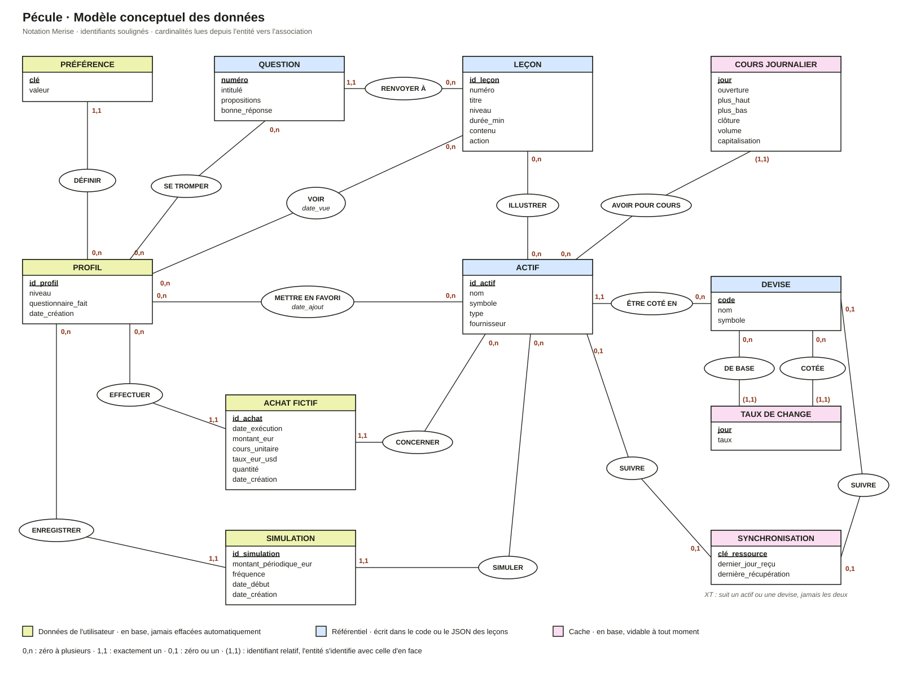

# MCD de Pécule

Le modèle conceptuel décrit les informations que Pécule manipule et les liens entre elles, sans se soucier de l'endroit où elles sont rangées. Il couvre donc tout : ce qui est en base, mais aussi ce qui est écrit dans le code (actifs, devises) ou dans le JSON des leçons (leçons, questions). Sans ces entités, un favori, un achat ou une leçon vue ne seraient reliés à rien.

Le passage aux vraies tables, avec ses simplifications, est décrit à la fin.

## Lire le schéma

- Un **rectangle** est une entité : une chose dont on garde des informations. Son identifiant est souligné.
- Une **ellipse** est une association : un lien entre deux entités, nommé par un verbe. Elle peut porter ses propres informations (en italique).
- Les **cardinalités** se lisent depuis l'entité vers l'association : combien de fois, au minimum et au maximum, une occurrence de l'entité participe à ce lien.
  - `0,n` : zéro, une ou plusieurs fois
  - `1,1` : exactement une fois
  - `0,1` : au plus une fois
  - `(1,1)` : exactement une fois, et l'entité ne peut pas être identifiée sans celle d'en face (identifiant relatif)
- La **couleur** de l'en-tête dit où vit l'information :
  - jaune, données de l'utilisateur : en base, jamais effacées automatiquement ;
  - bleu, référentiel : écrit dans le code ou dans le JSON des leçons, identique pour tout le monde ;
  - rose, cache : en base, reconstructible, vidable à tout moment.

Exemple de lecture, pour ACHAT FICTIF et ACTIF avec CONCERNER : « un achat concerne exactement un actif (1,1) ; un actif est concerné par zéro, un ou plusieurs achats (0,n) ».

## Règles de gestion

Elles disent en français ce que le schéma dit en cardinalités. Chaque règle correspond à une association.

### Profil et apprentissage

- **RG1, DÉFINIR.** Le profil définit zéro ou plusieurs préférences. Une préférence appartient à exactement un profil.
- **RG2, SE TROMPER.** Le profil s'est trompé à zéro ou plusieurs questions du questionnaire. Une question peut avoir été ratée ou non.
- **RG3, RENVOYER À.** Chaque question renvoie à exactement une leçon. Une leçon est liée à zéro ou plusieurs questions : trois leçons n'ont aucune question (intérêts composés, plus forte baisse, effet de change).
- **RG4, VOIR.** Le profil a vu zéro ou plusieurs leçons. On retient la date à laquelle la leçon a été vue pour la première fois.
- **RG5, ILLUSTRER.** Une leçon s'appuie sur zéro ou plusieurs actifs réels (la volatilité compare Coca-Cola et Tesla). Un actif illustre zéro ou plusieurs leçons.

### Profil et actifs

- **RG6, METTRE EN FAVORI.** Le profil met en favori zéro ou plusieurs actifs. On retient la date d'ajout. Un actif est en favori ou non.
- **RG7, EFFECTUER.** Le profil effectue zéro ou plusieurs achats fictifs. Un achat est effectué par exactement un profil.
- **RG8, CONCERNER.** Un achat concerne exactement un actif. Un actif peut avoir été acheté zéro ou plusieurs fois.
- **RG9, ENREGISTRER.** Le profil enregistre zéro ou plusieurs simulations. Une simulation appartient à exactement un profil.
- **RG10, SIMULER.** Une simulation porte sur exactement un actif. Un actif peut faire l'objet de zéro ou plusieurs simulations.

### Actifs, devises et cache

- **RG11, ÊTRE COTÉ EN.** Un actif est coté dans exactement une devise. Une devise cote zéro ou plusieurs actifs. Aujourd'hui, les 30 actifs sont tous cotés en dollars.
- **RG12, AVOIR POUR COURS.** Un actif a zéro ou plusieurs cours journaliers. Un cours journalier appartient à exactement un actif, et c'est le couple (actif, jour) qui l'identifie : sans son actif, « le cours du 4 octobre » ne veut rien dire.
- **RG13, DE BASE et COTÉE.** Un taux de change relie exactement deux devises un jour donné : une devise de base (EUR) et une devise cotée (USD). Il est identifié par (jour, devise de base, devise cotée). Le taux dit combien d'unités de la devise cotée vaut une unité de la devise de base : 1 € = 1,0952 $.
- **RG14, SUIVRE.** Une synchronisation suit soit un actif (son historique de cours), soit une devise (ses taux face à l'euro), jamais les deux et jamais aucun : c'est la contrainte XT, pour « exclusion et totalité ». Un actif ou une devise a au plus une synchronisation.

### Règles qui ne se dessinent pas

- **RG15.** Il n'existe qu'un seul profil : Pécule n'a pas de comptes.
- **RG16.** Le niveau du profil se calcule à partir du questionnaire : 0 à 1 bonne réponse donne Découverte, 2 à 3 Initié, 4 à 5 À l'aise. Un questionnaire passé donne Découverte.
- **RG17.** Le niveau du profil et celui des leçons décident de l'ordre des leçons dans Apprendre.
- **RG18.** Un achat fige le cours et le taux utilisés. Il n'est pas relié aux cours journaliers : vider le cache ne change jamais sa valeur d'achat.
- **RG19.** Une simulation ne garde que ses paramètres. Son résultat est recalculé à chaque ouverture à partir des cours.
- **RG20.** Le montant d'un achat est strictement positif, d'au plus 1 000 000 €, avec deux décimales au plus. Sa date n'est ni dans le futur ni avant le premier cours connu.
- **RG21.** Le montant périodique d'une simulation va de 1 € à 10 000 €. Sa date de début précède aujourd'hui d'au moins une période et suit le premier cours connu.
- **RG22.** Vider le cache supprime les cours, les taux et les synchronisations, et rien d'autre.

## Dictionnaire des données

### PROFIL (utilisateur)

| Attribut | Signification | Type | Exemple |
| --- | --- | --- | --- |
| id_profil | Identifiant, toujours le même puisqu'il n'y a qu'un profil | Entier | 1 |
| niveau | Niveau issu du questionnaire | Découverte, Initié, À l'aise | Initié |
| questionnaire_fait | Le questionnaire a été fait ou passé | Booléen | vrai |
| date_création | Création du profil | Date et heure | 05/10/2026 17:02 |

### PRÉFÉRENCE (utilisateur)

| Attribut | Signification | Type | Exemple |
| --- | --- | --- | --- |
| clé | Nom de la préférence | Texte | à définir, le cahier n'en liste aucune |
| valeur | Valeur enregistrée | Texte | |

### ACHAT FICTIF (utilisateur)

| Attribut | Signification | Type | Exemple |
| --- | --- | --- | --- |
| id_achat | Identifiant | Entier | 12 |
| date_exécution | Date d'achat choisie par l'utilisateur | Date | 04/01/2026 |
| montant_eur | Somme investie | Décimal, en euros | 150,00 |
| cours_unitaire | Cours utilisé, dans la devise de l'actif, figé | Décimal | 243,36 |
| taux_eur_usd | Taux utilisé, figé | Décimal | 1,0952 |
| quantité | Quantité obtenue | Décimal | 0,6750 |
| date_création | Moment où l'achat a été enregistré | Date et heure | 05/10/2026 17:10 |

### SIMULATION (utilisateur)

| Attribut | Signification | Type | Exemple |
| --- | --- | --- | --- |
| id_simulation | Identifiant | Entier | 3 |
| montant_périodique_eur | Somme investie à chaque fois | Décimal, en euros | 50,00 |
| fréquence | Rythme des achats | semaine, mois | mois |
| date_début | Premier achat simulé | Date | 01/01/2022 |
| date_création | Moment de l'enregistrement | Date et heure | 05/10/2026 17:20 |

### Associations porteuses d'informations

| Association | Attribut | Signification | Type |
| --- | --- | --- | --- |
| VOIR | date_vue | Première ouverture de la leçon | Date et heure |
| METTRE EN FAVORI | date_ajout | Ajout aux favoris | Date et heure |

### ACTIF (référentiel, dans le code)

| Attribut | Signification | Type | Exemple |
| --- | --- | --- | --- |
| id_actif | Identifiant chez le fournisseur | Texte | AAPL, bitcoin |
| nom | Nom affiché | Texte | Apple |
| symbole | Symbole affiché | Texte | AAPL, BTC |
| type | Famille d'actif | action, ETF, crypto | action |
| fournisseur | API qui fournit ses cours | Twelve Data, CoinGecko | Twelve Data |

### DEVISE (référentiel, dans le code)

| Attribut | Signification | Type | Exemple |
| --- | --- | --- | --- |
| code | Code ISO | Texte | USD |
| nom | Nom | Texte | Dollar américain |
| symbole | Symbole affiché | Texte | $ |

### LEÇON (référentiel, JSON)

| Attribut | Signification | Type | Exemple |
| --- | --- | --- | --- |
| id_leçon | Identifiant | Texte | volatilite |
| numéro | Ordre d'affichage | Texte | 06 |
| titre | Titre | Texte | La volatilité |
| niveau | Niveau visé | Découverte, Initié, À l'aise | Initié |
| durée_min | Temps de lecture | Entier, en minutes | 3 |
| contenu | Paragraphes de la leçon | Liste de textes | |
| action | Ce que fait le bouton final et son libellé | fiche, simulation, patrimoine | fiche, « Voir le score de Tesla » |

### QUESTION (référentiel, dans le code)

| Attribut | Signification | Type | Exemple |
| --- | --- | --- | --- |
| numéro | Ordre dans le questionnaire | Entier, de 1 à 5 | 3 |
| intitulé | Question posée | Texte | La volatilité, c'est… |
| propositions | Les quatre réponses proposées | Liste de 4 textes | |
| bonne_réponse | Position de la bonne réponse | Entier, de 0 à 3 | 1 |

### COURS JOURNALIER (cache)

| Attribut | Signification | Type | Exemple |
| --- | --- | --- | --- |
| jour | Jour de cotation, avec l'actif comme identifiant | Date | 03/10/2026 |
| ouverture, plus_haut, plus_bas | Cours de la journée, dans la devise de l'actif. Vides pour les cryptos, que CoinGecko ne détaille pas | Décimal ou vide | 330,00 |
| clôture | Dernier cours de la journée, dans la devise de l'actif | Décimal | 330,32 |
| volume | Quantité échangée dans la journée | Décimal | 48 213 000 |
| capitalisation | Valeur totale en circulation, pour les cryptos seulement | Décimal ou vide | |

### TAUX DE CHANGE (cache)

| Attribut | Signification | Type | Exemple |
| --- | --- | --- | --- |
| jour | Jour du taux, avec les deux devises comme identifiant | Date | 03/10/2026 |
| taux | Unités de devise cotée pour une unité de devise de base | Décimal | 1,0952 |

### SYNCHRONISATION (cache)

| Attribut | Signification | Type | Exemple |
| --- | --- | --- | --- |
| clé_ressource | Ce qui est suivi : un actif ou une paire de devises | Texte | asset:AAPL, fx:EUR:USD |
| dernier_jour_reçu | Jour le plus récent présent en base | Date | 03/10/2026 |
| dernière_récupération | Dernier appel réussi à l'API | Date et heure | 04/10/2026 18:02 |

## Du MCD aux tables

En appliquant les règles de passage classiques, on obtient les tables du cahier des charges (section 6.2), avec cinq simplifications volontaires.

### Tables

Clé primaire en gras, référence vers une autre entité précédée de `#`.

| Table | Colonnes | Vient de |
| --- | --- | --- |
| user_profile | **id**, level, quiz_mistakes, onboarding_done, created_at | PROFIL et SE TROMPER |
| preference | **key**, value | PRÉFÉRENCE |
| lesson_progress | **#lesson_id**, seen_at | VOIR |
| favorite | **#asset_id**, added_at | METTRE EN FAVORI |
| paper_transaction | **id**, #asset_id, executed_on, amount_eur, unit_price, price_currency, eur_usd_rate, quantity, created_at | ACHAT FICTIF, EFFECTUER, CONCERNER |
| saved_simulation | **id**, #asset_id, periodic_amount_eur, frequency, start_date, created_at | SIMULATION, ENREGISTRER, SIMULER |
| price_bar | **#asset_id**, **day**, open, high, low, close, volume, market_cap | COURS JOURNALIER et AVOIR POUR COURS |
| fx_rate | **day**, **#base**, **#quote**, rate | TAUX DE CHANGE, DE BASE, COTÉE |
| sync_state | **resource_key**, last_data_day, last_fetched_at | SYNCHRONISATION et SUIVRE |

### Simplifications volontaires

1. **Pas de colonne profil.** Il n'y a qu'un profil (RG15), donc `favorite`, `lesson_progress`, `paper_transaction`, `saved_simulation` et `preference` ne portent pas d'`id_profil`. Si un jour il y avait des comptes, il faudrait l'ajouter partout.
2. **Le référentiel n'est pas en base.** ACTIF, DEVISE, LEÇON et QUESTION vivent dans le code ou le JSON. `asset_id` et `lesson_id` y renvoient par leur valeur, sans contrainte de clé étrangère possible. Conséquence : on ne supprime jamais un actif ou une leçon du référentiel tant que des données utilisateur peuvent y renvoyer.
3. **SE TROMPER devient une liste.** Au lieu d'une table, les erreurs du questionnaire sont rangées dans `user_profile.quiz_mistakes`, sous forme de liste des leçons concernées. C'est ce que fait la maquette, et ça suffit puisqu'on ne s'en sert que pour choisir les leçons conseillées.
4. **Un achat copie ce qu'il pourrait retrouver.** `price_currency` se déduit de l'actif (RG11), et `unit_price` et `eur_usd_rate` des cours en cache. On les copie quand même pour figer l'achat (RG18).
5. **La contrainte XT tient dans une clé texte.** `sync_state` n'a qu'une colonne `resource_key`, dont le préfixe dit ce qui est suivi : `asset:` pour un actif, `fx:` pour une paire de devises.

## Points à valider

- Le format exact de `resource_key` (`asset:AAPL`, `fx:EUR:USD`) est une proposition.
- `quiz_mistakes` contient les leçons associées aux questions ratées, comme dans la maquette. On pourrait aussi y ranger les numéros de questions : plus fidèle au MCD, mais il faudrait refaire la correspondance à chaque lecture.
- Aucune préférence précise n'est listée dans le cahier. La table est prête, son contenu reste à décider.
